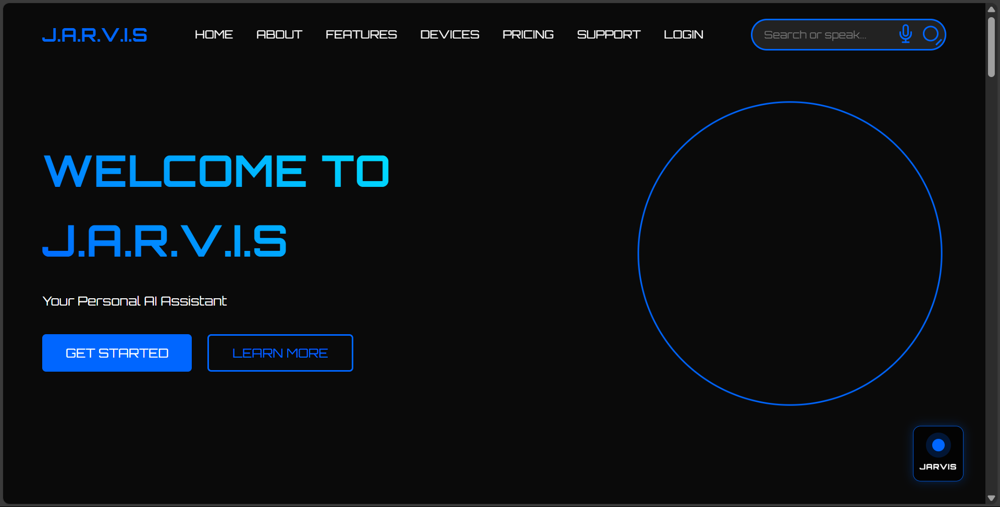
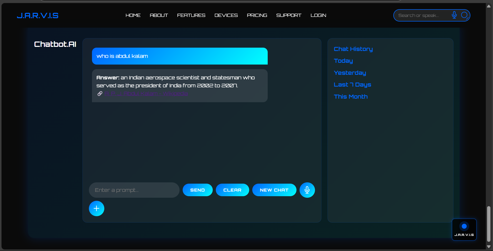
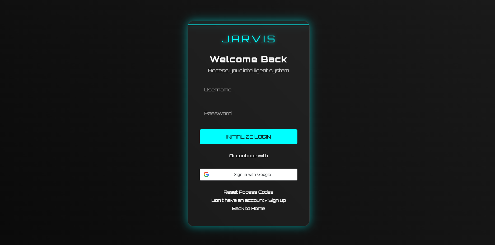
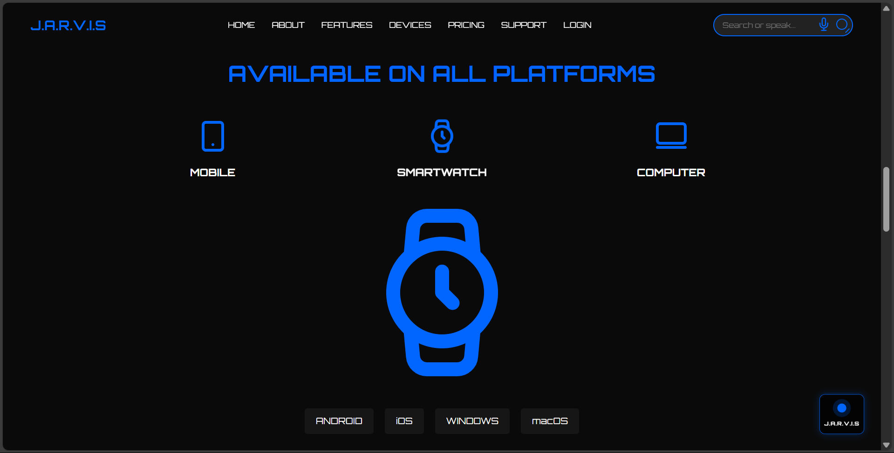

# 🤖 J.A.R.V.I.S (Just A Rather Very Intelligent System)

## 🚀 About Project
J.A.R.V.I.S is a web-based AI assistant that can perform tasks using voice commands, intelligent search, and smart responses.  
It provides a futuristic interface with voice interaction, chatbot functionality, and automation features.

## ✨ Features
- 🎙 Voice Recognition (Speech-to-Text)
- 🔊 Text-to-Speech Conversion
- 🤖 AI Chatbot (Google Search API Integration)
- 🔍 Smart Search System
- 🔐 Login & Authentication System
- 💻 Modern UI with animations
- ⚡ Fast and interactive web interface

## 🛠 Technologies Used
- HTML  
- CSS  
- JavaScript  
- Web Speech API  
- Google Custom Search API  

## ▶️ How to Run
1. Download or clone the repository  
2. Open `index.html` in your browser  
3. Use the microphone button for voice commands  

## 📸 Project Screenshots

### 🏠 Home Page

### 🤖 Assistant Interface

### 🔐 Login Page

### 💳 Pricing Plans

### 📱 Devices Section

## 📌 Future Improvements
- 🤖 ChatGPT API Integration  
- 📱 Mobile App Version  
- 🌐 Backend Integration (Node.js / Database)  
- 🔒 Advanced Authentication System  

## 👨‍💻 Author
**Shivam Kapoor**  
CSE Student | Python & Web Development Enthusiast  
